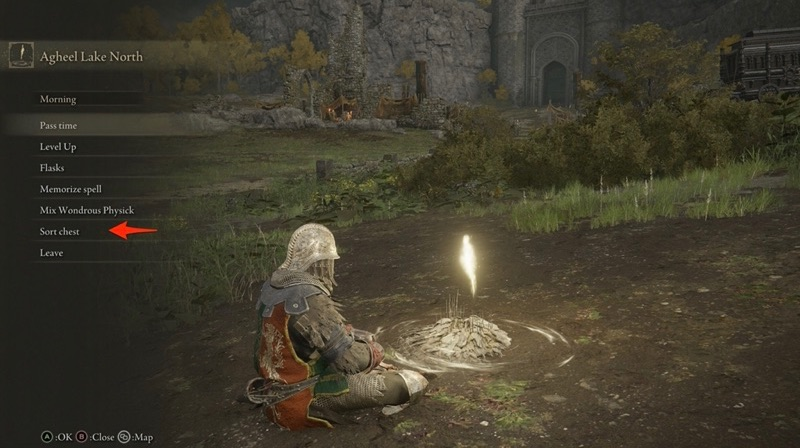
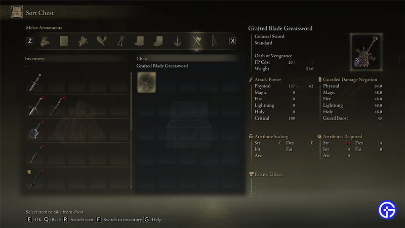

# Elden Ring Inventory Extractor

This is a terrible procedural script that works for me.  YMMV.

## Requirements

You'll need to have the following packages installed (I used brew in OSX):
* ffmpeg
    * for both ffmpeg and ffprobe
* imagemagick
* tesseract  
* yt-dlp

## Usage

### Step 1

To record an input for this tool, rest at a site of grace and go to the "Sort Chest" item option:



Start recording, and page through your inventory (on both the local inventory and chest sides):



Stop your recording when you've scrolled through everything you want, and share the video to YouTube.

### Step 2

Change the `VIDEO_URL` string at the top of the file to point to a youtubevideo that
you shared.  Note that I have only tested this with HD videos.

```ruby
  VIDEO_URL = "https://www.youtube.com/watch?v=31gqB5eUC94"
```

### Step 3

Run the script.

```
% ruby run.rb
```

This will take a while.  The script is:

1. Downloading the video via yt-dlp
2. Split the video into frames via imagemagick
3. trim a specific part of the frame out for OCR
4. OCR the strings out of the trimmed frames

Once the script is done, it will output a list of all the item names it found to STDOUT.

